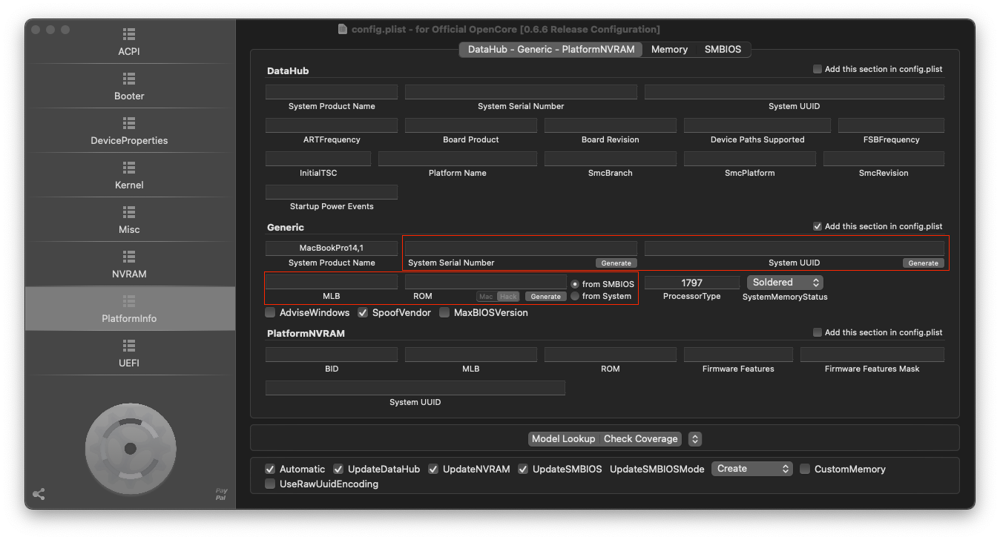

## Get Start
You need to manually add Platforminfo with OpenCore Configurator

## Compatibility
- can't use hdmi/DP output, only use internal screen
- can't use nvidia 1060 display card

## Hardware
cpu: i5-7300

## Bios
https://github.com/vincent-chang-rightfighter/GL62M-7RDX-Hackintosh?tab=readme-ov-file#bios-configuration